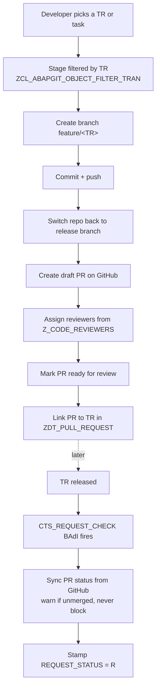

# zabapgit_v4

A fork of [abapGit](https://github.com/abapGit/abapGit) with transport-driven Git automation:
every push to GitHub is staged from a transport request, lands on its own feature branch, and opens
a pull request that stays linked to that transport for its whole life.

Upstream abapGit stages whatever changed in a package. This fork stages **what is in a TR**, so the
Git history and the SAP transport history stay in step, and a reviewer can always tell which task of
which request they are looking at.

## The workflow



**Target branch resolution** — the PR base is picked in this order:

1. `release/<SYSID>*` (e.g. `release/DHA*`)
2. `main` or `master`
3. the repository's HEAD symref

**Parent vs task** — several developers often work under one parent request. The PR is linked using
both `PARENT_REQUEST` and `TASK_REQUEST`, so each developer's task gets its own PR under a shared
parent. `TASK_REQUEST` is only filled when the staged TR is not its own parent.

## What is custom in this fork

Everything else is upstream abapGit. Treat upstream files as vendor code.

| Object | Package | Purpose |
| --- | --- | --- |
| `ZCL_ABAPGIT_PR_SERVICE` | `ZABAPGIT_DEPLOY_API` | **Headless** stage → branch → commit → PR, callable without the GUI |
| `ZCL_ABAPGIT_PR_STATUS_MANAGER` | `ZABAPGIT_UTILS` | PR ↔ TR linkage, GitHub status sync |
| `ZCL_IM_GIT_PR_CHECK` | `ZABAPGIT` | `CTS_REQUEST_CHECK` BAdI — syncs PR status at transport release |
| `ZCL_ABAPGIT_LOGGING_UTILS` | `ZABAPGIT` | Application log (BAL) wrapper used for the audit trail |
| `ZDT_PULL_REQUEST` / `ZDE_PR_STATUS` | `ZABAPGIT_UTILS` | PR ↔ TR link table and status domain |
| `ZI_PullRequest` + `ZSB_PULLREQUEST_API` | `ZABAPGIT_APIS` | OData V4 service over the link table |

**Modified upstream class — merge hazard:** `ZCL_ABAPGIT_PR_ENUM_GITHUB` (`ZABAPGIT_GIT_PLATFORM`).
Upstream only *enumerates* PRs. This fork added `create_pull_request`, `assign_reviewers`,
`ready_for_review` (GraphQL `markPullRequestReadyForReview`), `get_pr_detailed_status` and
`update_pull_request_branch`. A future abapGit upgrade will conflict here.

## Configuration

All of it lives in TVARVC. Nothing works without these.

| Variable | Type | Purpose |
| --- | --- | --- |
| `ZGIT_REPO_URL` | Parameter | Repository URL used by the BAdI when syncing PR status |
| `ZGIT_API_KEY` | Parameter (`P`) | GitHub token used by the BAdI and the commit GUI page |
| `Z_CODE_REVIEWERS` | Select-option (multi-row) | GitHub usernames to request review from |

> `ZCL_ABAPGIT_PR_SERVICE` deliberately does **not** use `ZGIT_API_KEY`. Each developer passes their
> own token, so no shared credential is needed. See *Headless API* below.

Also required:

- BAdI implementation `ZGIT_PR_CHECK` active for enhancement spot `CTS_REQUEST_CHECK`
- Repository registered in abapGit with a transport request in **Local Settings** if the package is
  transportable

**Hardcoded values, currently in code rather than config:**

- Fallback reviewer `sekanaga_cisco`, used when `Z_CODE_REVIEWERS` is empty or only contains the
  requesting user
- SAP user → GitHub user mapping is `<SAP user>_cisco`

The PR author is always removed from the reviewer list so nobody reviews their own PR.

## Headless API

`ZCL_ABAPGIT_PR_SERVICE` does from code what the commit page does from the GUI.

```abap
DATA(lo_service) = zcl_abapgit_pr_service=>create( iv_package = 'ZMY_PACKAGE' ).

DATA ls_request TYPE zcl_abapgit_pr_service=>ty_request.
ls_request-transport      = 'DHAK900123'.
ls_request-commit_message = 'FIX: correct tax determination'.
ls_request-pr_body        = 'Closes JIRA-1234'.

" Read-only: what would be staged, which branches, which reviewers
DATA(ls_preview) = lo_service->preview( ls_request ).

" Do it
DATA(ls_result) = lo_service->stage_and_raise_pr( ls_request ).
WRITE ls_result-pr_url.
```

- `preview( )` writes nothing — use it to confirm the object list before acting
- `ls_request-dry_run = abap_true` goes one step further and resolves everything without touching
  GitHub
- **Authentication is per developer.** `ls_request-git_token` is used if supplied; otherwise the
  service falls back to the credential abapGit already stored for *this SAP user and this repository*.
  If neither exists it fails with a clear message rather than a bare 401. No shared token is read,
  and the token is never written to the application log.
  This matters because repositories live under different GitHub orgs and need different tokens.
- Credentials are established before any remote call, since branch resolution and status calculation
  both reach GitHub
- Refuses released transports up front, and refuses non-GitHub repository URLs
- Every step is written to application log `ZABAPGIT` / `COMMIT`

### Known duplication

`ZCL_ABAPGIT_PR_SERVICE` **copies** rather than calls the orchestration in
`ZCL_ABAPGIT_GUI_PAGE_COMMIT`, whose methods are private and interleaved with `MESSAGE` statements.
The GUI page was deliberately left untouched. The two must be kept in sync — the regression net is to
run two sibling TRs, one through each path, and diff the resulting PR and `ZDT_PULL_REQUEST` row.

## Repository layout

`.abapgit.xml` uses `FOLDER_LOGIC = FULL` with `STARTING_FOLDER = /src/`, so the SAP package
hierarchy maps directly onto folders:

```text
src/
  zabapgit_apis/              ZABAPGIT_APIS         OData services over the PR link table
    zabapgit_deploy_api/      ZABAPGIT_DEPLOY_API   headless stage + PR service
  zabapgit_git_platform/      GitHub/Gitea PR providers
  zabapgit_utils/             PR status manager, link table
  zabapgit_repo/              repo, staging, object filters
  zabapgit_objects/           object serializers
  ...
```

## Conventions

Follow **abapGit house style** inside this repo, not the conventions used elsewhere in the SAP
landscape. Verified against the existing source:

- Attributes `mv_` / `mi_` / `mo_` / `mt_` — not `gv_` / `gs_`
- Locals `lv_` / `ls_` / `lt_` / `lo_` / `li_` (interface refs) / `lx_` (exceptions)
- Parameters `iv_` / `is_` / `it_` / `ii_` / `io_`, returning `rv_` / `rs_` / `rt_` / `ri_` / `ro_`
- Types `ty_*`, table types `ty_*_tt`, constants `c_*`
- `CREATE OBJECT`, never `NEW #( )` — there are zero occurrences of `NEW #(` in this repo
- Inline literals over local `lc_` constants — there are zero `CONSTANTS lc_` in this repo

The system is 7.55+, so use `FIND PCRE` / `replace( pcre = ... )`. `FIND REGEX` still appears in
older code and raises a deprecation warning.

> Watch out: `IMPORTING` parameters are pass-by-reference by default, which requires *compatible*
> types rather than merely convertible ones. Passing an `i` into an `int8` parameter is a syntax
> error — convert explicitly at the call site.

## Background mode

Scheduling report `ZABAPGIT` in batch runs `ZCL_ABAPGIT_BACKGROUND=>RUN`, which processes **every**
repository configured under *Advanced → Background Mode*.

Be careful with automatic pull: it answers **yes to every overwrite decision**, so local SE80 changes
are silently reverted and objects missing from Git are deleted. Guards are the repo's *Write
Protected* flag, the `ORIGINAL_SYSTEM` setting in `.abapgit.xml`, and object locks. Background mode
never prompts for a transport — it fails with *No transport request was supplied* unless one is set
in Local Settings or supplied by the `determine_transport_request` user exit.
